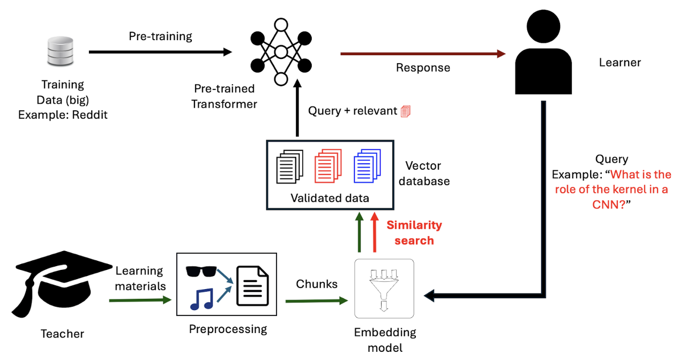

# PlutarchOS

## Image 

 RAG-moderated interactions: A teacher provides learning materials as lecture slides or lecture recordings. A preprocessing step turns them into a transcript which is cut into chunks that are fed to an embedding model. The embedded chunks are stored in a vector database. Learners ask questions by querying this database, where the embedding model converts the query to enable a similarity search that retrieves and appends the most relevant chunks. Technical details can be found on the GitHub page.

## Description
In a preprocessing step, the slides are processed by a vision-based model (e.g. GPT-4 Vision), 
and recordings are processed by an audio-to-text model (e.g. OpenAI’s Whisper) to create a transcript. The transcript is recursively cut into chunks of a predefined character amount with some overlap to provide context. These chunks are fed to an embedding model to convert tokens to embeddings. Once the chunks are embedded, they are stored in a vector database. Learners can ask questions by querying this vector database. First, the embedding model converts the query to an embedding. Then, a similarity search retrieves the most relevant chunks and appends them to the query. The LLM uses its pre-trained knowledge in combination with the chunks provided in the augmented query to answer the learner.

